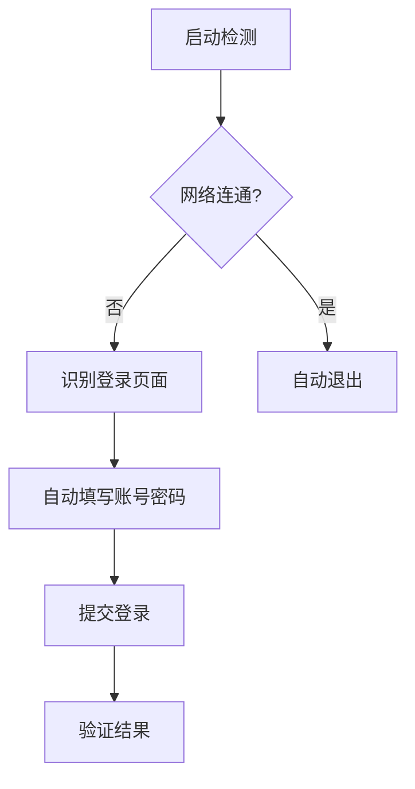

# 🏫 校园网自动登录工具

[](https://opensource.org/licenses/MIT)
[](https://www.python.org/)
[]()

> 基于 Python + Selenium 的校园网自动化登录工具 | 安全存储账号 | 支持多平台

---

## 📖 项目简介
通过浏览器自动化实现校园网登录，解决手动登录繁琐问题。核心功能：
- ✅ 自动检测登录状态
- 🔒 密码安全存储（系统密钥环）
- 🖥️ 图形化操作界面
- 📅 开机自启动

---

## ✨ 功能特点
| 特性 | 说明 |
|------|------|
| **智能检测** | 多道验证机制判断是否需要登录 |
| **安全存储** | 使用系统密钥环保存密码，无明文存储 |
| **跨平台** | Windows/macOS/Linux 全支持 |
| **日志记录** | 详细运行日志便于排查问题 |

---

## 🛠️ 安装要求

### 系统依赖
- [Python 3.7+](https://www.python.org/downloads/)
- [Firefox 浏览器](https://www.mozilla.org/firefox/)
- `geckodriver`（自动安装）

### Python 依赖
```bash
# 安装依赖
pip install -r requirements.txt
```

<details>
<summary>📜 requirements.txt 内容</summary>

```text
selenium>=4.0.0
requests>=2.26.0
keyring>=23.0.1
pywin32>=300 ; sys_platform == 'win32'
```
</details>

---

## 🚀 使用指南

### 图形界面模式
```bash
python campus_login.py
```
1. 输入校园网账号密码  
2. 点击"保存设置"  
3. 点击"立即登录"测试  

### 静默自动模式
```bash
python campus_login.py --auto
```

### 开机自启动
勾选界面中的 `开机自动启动并自动登录` 选项

---

## ⚙️ 配置说明
配置文件路径：`~/.campus_login_config.json`  
```json
{
  "username": "学号",
  "autostart": true,
  "firefox_path": "/path/to/firefox",
  "url": "https://login.example.com"
}
```
> 🔒 密码通过系统密钥环存储，不会出现在配置文件中

---

## 🔍 技术实现


---

## ❓ 常见问题
<details>
<summary><b>Q: 无法找到 Firefox 浏览器？</b></summary>

- 确认已安装 [Firefox](https://www.mozilla.org/firefox/)
- 或手动指定 Firefox 路径
</details>

<details>
<summary><b>Q: 登录失败如何调试？</b></summary>

1. 检查日志文件  
2. 尝试手动访问登录页面  
3. 更新页面元素识别规则  
</details>

---

## ⚠️ 免责声明
*本工具仅供学习交流，使用者应遵守学校网络规定，擅自使用造成的风险自行承担。*

---

## 📜 许可证
[MIT License](LICENSE) © 2025 Rubisco0326
```
